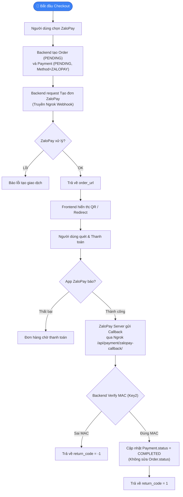
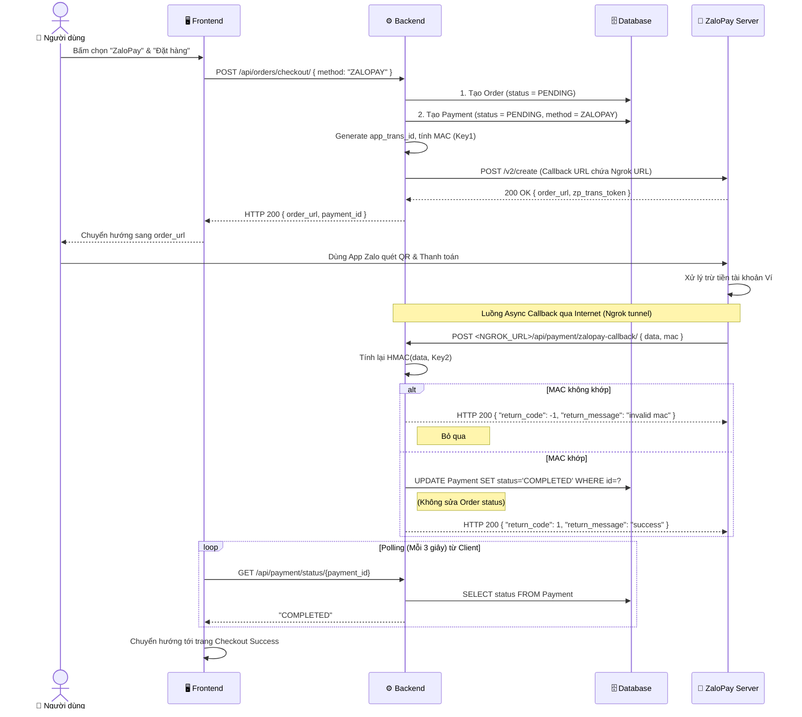

# 📋 Đặc tả & Thiết kế — Thanh toán bằng QR qua ZaloPay (Sandbox)

---

## Mục lục

1. [Phần 1 — Business Analyst](#phần-1--business-analyst)
   - [1.1 Tổng quan yêu cầu](#11-tổng-quan-yêu-cầu)
   - [1.2 Đặc tả yêu cầu](#12-đặc-tả-yêu-cầu)
   - [1.3 Flowchart](#13-flowchart)
2. [Phần 2 — System Architect](#phần-2--system-architect)
   - [2.1 Phân tích hiện trạng hệ thống](#21-phân-tích-hiện-trạng-hệ-thống)
   - [2.2 Đánh giá tính khả thi](#22-đánh-giá-tính-khả-thi)
   - [2.3 Sequence Diagram](#23-sequence-diagram)
   - [2.4 Thiết kế API Endpoints](#24-thiết-kế-api-endpoints)
   - [2.5 Thiết kế Database](#25-thiết-kế-database)
   - [2.6 Cấu trúc file cần thay đổi / tạo mới](#26-cấu-trúc-file-cần-thay-đổi--tạo-mới)

---

# Phần 1 — Business Analyst

## 1.1 Tổng quan yêu cầu

| # | Tính năng | Mô tả ngắn | Ưu tiên |
|---|-----------|-------------|---------|
| FR-01 | Thanh toán bằng QR ZaloPay | Cho phép người dùng đặt hàng và chọn thanh toán bằng ví ZaloPay/App ZaloPay. Hệ thống sinh mã QR (hoặc redirect) để quét | Cao |
| FR-02 | Nhận Webhook Callback qua Ngrok | Sau khi thanh toán thành công, ZaloPay gọi về Backend qua địa chỉ Ngrok để chuyển trạng thái giao dịch | Cao |

---

## 1.2 Đặc tả yêu cầu

### Mã yêu cầu: `FR-01` & `FR-02`

### Mô tả
Tích hợp cổng ZaloPay Sandbox. Đặc biệt lưu ý: Trạng thái của Đơn hàng (`Order`) do Staff/Admin quyết định (chuyển từ PENDING sang PROCESSING, SHIPPED v.v.). **Chỉ thay đổi trạng thái của Giao dịch thanh toán (`Payment`) tương ứng** từ `PENDING` thành `COMPLETED` khi dòng tiền thực tế về ví. 

### Actor
- Khách hàng (Customer)
- ZaloPay Server (Sandbox)

### Precondition (Điều kiện tiên quyết)
- Người dùng có sản phẩm trong giỏ hàng.
- Backend đang chạy Ngrok để map localhost ra public URL.
- Config `APP_ID`, `KEY1`, `KEY2` của ZaloPay Sandbox đã sẵn sàng.

### Luồng chính (Main Flow)

| Bước | Actor | Hệ thống |
|------|-------|----------|
| 1 | Truy cập trang Checkout & chọn "ZaloPay" | |
| 2 | | Nhận thông tin đơn hàng, lưu `Order` (Status: `PENDING`) và tạo 1 record `Payment` liên kết với Order đó (Status: `PENDING`, Method: `ZALOPAY`). |
| 3 | | Backend gọi API `/v2/create` tới ZaloPay Server để tạo giao dịch, gửi kèm URL Webhook (Ngrok). |
| 4 | | ZaloPay trả về `order_url`. Backend gửi lại URL này cho Frontend. |
| 5 | | Frontend chuyển hướng người dùng sang trang thanh toán ZaloPay (hoặc hiển thị QR). |
| 6 | Quét mã / Xác nhận thanh toán trên App | |
| 7 | | ZaloPay Server xử lý trừ tiền. |
| 8 | ZaloPay gọi Callback POST tới Backend (Ngrok) | Backend kiểm tra chuỗi chữ ký (MAC) sử dụng `KEY2`. |
| 9 | | MAC hợp lệ → Cập nhật bản ghi `Payment` (Trạng thái: `COMPLETED`, field `transaction_ref` = `zp_trans_id`). **Không thay đổi trạng thái của `Order`**. |
| 10 | | Trả về HTTP 200 `{ "return_code": 1 }` cho ZaloPay. |
| 11 | Nhấn "Tôi đã thanh toán" hoặc Polling trên FE | Frontend gọi API kiểm tra trạng thái Payment. Nếu thành công → Hiển thị trang Success. |

### Luồng ngoại lệ (Exception Flow)

| # | Tình huống | Xử lý |
|---|-----------|-------|
| E1 | Tạo đơn ZaloPay thất bại | Trả về lỗi, người dùng chọn lại phương thức thanh toán khác. |
| E2 | Callback từ ZaloPay có MAC không hợp lệ | Đánh dấu lỗi, bỏ qua tác động lên Database, trả về `{ "return_code": -1 }`. |
| E3 | Khách hàng đóng trình duyệt sau khi quét | Đơn hàng vẫn được thanh toán do Webhook gọi độc lập (Server-to-Server). Giao dịch `Payment` vẫn sẽ là `COMPLETED`. |

---

## 1.3 Flowchart



---

# Phần 2 — System Architect

## 2.1 Phân tích hiện trạng hệ thống

### Backend (Django)

| Thành phần | File | Trạng thái |
|-----------|------|-----------|
| Order Model | `backend/orders/models.py` | ✅ Đã có — Quản lý trạng thái giao hàng `PENDING`, `PROCESSING`... (Phụ thuộc Staff). |
| Payment Model | `backend/payment/models.py` | ✅ Đã có — Liên kết FK với `Order` và `TradeInRequest`. Có field `status` (`PENDING`, `COMPLETED`, `FAILED`, `REFUNDED`), `payment_method` (`CASH`, `BANK_TRANSFER`, `COD`). **Chưa có loại thẻ `ZALOPAY`**. |
| ZaloPay API Integration | `backend/payment/services/` | ❌ **Chưa có — Cần tạo logic gọi API ZaloPay và verify HMAC**. |
| Webhook API | `backend/payment/views.py` | ❌ **Chưa có — Cần tạo Endpoint nhận POST từ ZaloPay**. |
| API Tạo thanh toán | `backend/orders/views.py` | ⚠️ Cần bổ sung logic tạo Order + Payment, nếu chọn ZaloPay thì trigger gọi API CreateOrder của ZaloPay. |
| Môi trường / Config | `backend/.env`, `settings.py` | ❌ **Chưa có — Cần biến môi trường cho ZALOPAY_APP_ID, KEY1, KEY2**. |

### Frontend (React)

| Thành phần | File | Trạng thái |
|-----------|------|-----------|
| Checkout Page | `frontend/src/pages/client/checkout/` | ✅ Đã có UI cơ bản, cần thêm option chọn thanh toán ZaloPay. |
| Nút Thanh toán | N/A | ⚠️ Cần code logic Redirect sang ZaloPay Checkout URL sau khi Backend trả về `order_url`. |
| Checkout Success Page | `frontend/src/pages/client/checkout-success/` | ✅ Đã có. |
| API Services | `frontend/src/services/client/payment/paymentService.ts` | ⚠️ Cần bổ sung hàm check status của giao dịch payment (dành cho Polling nếu cần). |

---

## 2.2 Đánh giá tính khả thi

### ✅ Tích hợp ZaloPay Sandbox — **KHẢ THI**

| Tiêu chí | Đánh giá |
|----------|----------|
| Kiến trúc thay đổi | Nhỏ. Mô hình `Payment` và `Order` tách biệt là một kiến trúc rất tốt hiện tại. Việc chỉ update `Payment` giữ đúng trách nhiệm dữ liệu: trạng thái thanh toán riêng biệt với trạng thái vận chuyển vật lý của `Order`. |
| Backend | Hoàn toàn kiểm soát được bằng Python `hmac`, `hashlib`, `requests`. Cần mở cổng Ngrok lúc run server cục bộ. |
| Database | Chỉ cần cập nhật thêm choice `ZALOPAY` vào Enum `PaymentMethod` của model `Payment`. Trạng thái `COMPLETED` của hệ thống đã tương đương với việc thực nhận tiền. |
| Bảo mật | HMAC SHA256 với Secret Key2 đáp ứng chuẩn bảo mật từ ZaloPay để chống request giả mạo. |
| Phụ thuộc | Cài đặt `requests` nếu server chưa có, khởi chạy binary `ngrok`. |

---

## 2.3 Sequence Diagram



---

## 2.4 Thiết kế API Endpoints

### 1. Webhook (Dành cho ZaloPay)
| Method | Endpoint | Auth | Mô tả |
|--------|----------|------|-------|
| `POST` | `/api/payment/zalopay-callback/` | ❌ AllowAny | Cập nhật `status = COMPLETED` cho object `Payment`. Không thay pin Authentication token do gọi từ phía Server ZaloPay. |

**Request Body (theo chuẩn ZaloPay):**
```json
{
  "data": "{\"app_id\": 2553, \"app_trans_id\": \"230920_123456\", \"app_time\": 1695191060000, \"amount\": 150000, ...}",
  "mac": "a1b2c3d4..."
}
```

**Response (`return_code = 1` hoặc `-1`):**
```json
{
  "return_code": 1,
  "return_message": "success"
}
```

### 2. Check Trạng Thái Dành Cho Frontend (Polling)
| Method | Endpoint | Auth | Mô tả |
|--------|----------|------|-------|
| `GET` | `/api/payment/{id}/status/` | Require Auth | Kiểm tra trạng thái của hóa đơn thanh toán để Frontend redirect màn hình thành công |

---

## 2.5 Thiết kế Database

**Cập nhật model `Payment` (`backend/payment/models.py`)**

```diff
    class PaymentMethod(models.TextChoices):
        CASH            = "CASH",            "Tiền mặt"
        BANK_TRANSFER   = "BANK_TRANSFER",   "Chuyển khoản ngân hàng"
        COD             = "COD",             "Thanh toán khi nhận hàng"
+       ZALOPAY         = "ZALOPAY",         "Ví ZaloPay"
```
> **Lý do**: Thêm ZaloPay như một hình thức Payment Method hợp lệ. Các field `status`, `transaction_ref` được giữ nguyên vì đã đáp ứng đủ yêu cầu lưu trữ mã giao dịch `zp_trans_id`. Đơn hàng (`Order`) sẽ nhận biết mình đã được thanh toán thông qua `order.payments.filter(status='COMPLETED').exists()`.

---

## 2.6 Cấu trúc file cần thay đổi / tạo mới

### Backend

| File | Hành động | Mô tả |
|------|-----------|-------|
| `backend/payment/models.py` | 🔧 MODIFY | Bổ sung `ZALOPAY` vào `PaymentMethod`. |
| `backend/payment/utils/zalopay.py` | 🆕 NEW | Thêm module tiện ích: Hàm generate hash HMAC với KEY1, KEY2, và HTTP Client gửi Request Create Order tới ZaloPay Endpoint. |
| `backend/payment/views.py` | 🔧 MODIFY | Thêm `ZaloPayCallbackView` (POST webhook handler) và `PaymentStatusView` (GET status). |
| `backend/payment/urls.py` | 🔧 MODIFY | Thêm routes cho `/api/payment/zalopay-callback/` và `/api/payment/<id>/status/`. |
| `backend/orders/views.py` | 🔧 MODIFY | Khi submit checkout chọn ZaloPay, tạo `Payment` và gọi tiện ích `create_zalopay_order()`. |
| `backend/config/settings.py` | 🔧 MODIFY | Load env vars: `ZALOPAY_APP_ID`, `ZALOPAY_KEY1`, `ZALOPAY_KEY2`. |
| `backend/.env` | 🔧 MODIFY | Đặt Secret Key và Config kết nối cho môi trường. |

### Frontend

| File | Hành động | Mô tả |
|------|-----------|-------|
| `frontend/src/pages/client/checkout/page.tsx` | 🔧 MODIFY | Thêm Radio Button "Thanh toán ZaloPay", Xử lý logic lúc submit form (Nhận `order_url` -> redirect). |
| `frontend/src/services/client/payment/paymentService.ts` | 🔧 MODIFY | Khai báo API interface gọi poller kiểm tra trạng thái thanh toán. |

### External Setup (ngoài code)

| Việc cần làm | Chi tiết |
|-------------|----------|
| Tài khoản Sandbox ZaloPay | Đăng ký tài khoản Sandbox trên cổng Developer ZaloPay để lấy config Key. |
| Cài đặt Ngrok | Developer cài Ngrok và chạy `ngrok http 8000` (giả sử Django chạy port 8000). Copy https url để paste vào `.env` `SERVER_NGROK_URL`. |

---
> **📝 Ghi chú:** Tài liệu trên mô tả kỹ thuật chuẩn xác cho chức năng ZaloPay. Hỗ trợ sự tách bạch chặt chẽ giữa logic kinh doanh Cửa hàng (Order) và logic của Kế toán (Payment), giúp hệ thống linh hoạt hơn đối với các kênh tích hợp Webhook.
