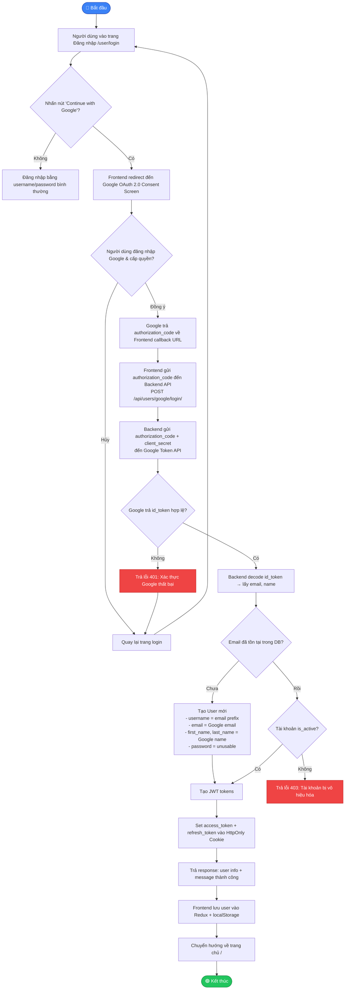
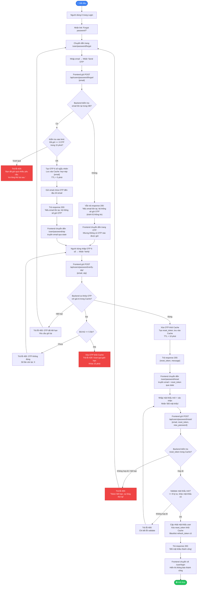
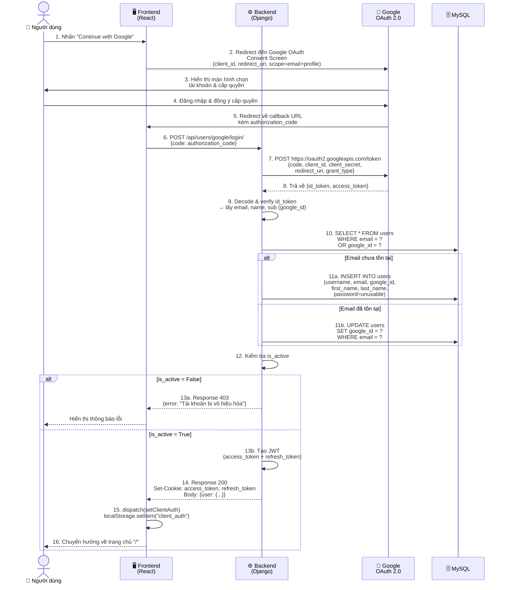
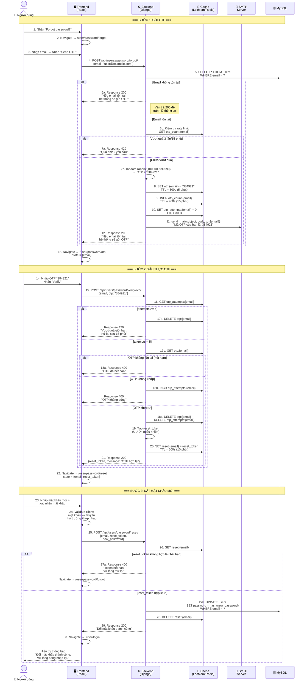

# 📋 Đặc tả & Thiết kế — Google Login + Quên mật khẩu (OTP)

---

## Mục lục

1. [Phần 1 — Business Analyst](#phần-1--business-analyst)
   - [1.1 Tổng quan yêu cầu](#11-tổng-quan-yêu-cầu)
   - [1.2 Đặc tả yêu cầu — Đăng nhập bằng Google](#12-đặc-tả-yêu-cầu--đăng-nhập-bằng-google)
   - [1.3 Đặc tả yêu cầu — Quên mật khẩu (OTP)](#13-đặc-tả-yêu-cầu--quên-mật-khẩu-otp)
   - [1.4 Flowchart — Đăng nhập bằng Google](#14-flowchart--đăng-nhập-bằng-google)
   - [1.5 Flowchart — Quên mật khẩu (OTP)](#15-flowchart--quên-mật-khẩu-otp)
2. [Phần 2 — System Architect](#phần-2--system-architect)
   - [2.1 Phân tích hiện trạng hệ thống](#21-phân-tích-hiện-trạng-hệ-thống)
   - [2.2 Đánh giá tính khả thi](#22-đánh-giá-tính-khả-thi)
   - [2.3 Sequence Diagram — Đăng nhập bằng Google](#23-sequence-diagram--đăng-nhập-bằng-google)
   - [2.4 Sequence Diagram — Quên mật khẩu (OTP)](#24-sequence-diagram--quên-mật-khẩu-otp)
   - [2.5 Thiết kế API Endpoints](#25-thiết-kế-api-endpoints)
   - [2.6 Thiết kế Database](#26-thiết-kế-database)
   - [2.7 Cấu trúc file cần thay đổi / tạo mới](#27-cấu-trúc-file-cần-thay-đổi--tạo-mới)

---

# Phần 1 — Business Analyst

## 1.1 Tổng quan yêu cầu

| # | Tính năng | Mô tả ngắn | Ưu tiên |
|---|-----------|-------------|---------|
| FR-01 | Đăng nhập bằng Google | Người dùng nhấn nút "Continue with Google" trên trang login → xác thực qua Google OAuth 2.0 → tự động tạo tài khoản (nếu chưa có) → đăng nhập thành công | Cao |
| FR-02 | Quên mật khẩu (OTP qua email) | Người dùng nhấn "Forgot password?" → nhập email → nhận OTP 6 số qua email → xác nhận OTP → đặt mật khẩu mới | Cao |

---

## 1.2 Đặc tả yêu cầu — Đăng nhập bằng Google

### Mã yêu cầu: `FR-01`

### Mô tả
Cho phép người dùng đăng nhập vào hệ thống ReTech Market bằng tài khoản Google mà không cần nhập username/password truyền thống.

### Actor
- Khách hàng (Customer)

### Precondition (Điều kiện tiên quyết)
- Người dùng có tài khoản Google hợp lệ
- Hệ thống đã đăng ký OAuth 2.0 Client trên Google Cloud Console
- Người dùng đang ở trang đăng nhập (`/user/login`)

### Luồng chính (Main Flow)

| Bước | Actor | Hệ thống |
|------|-------|----------|
| 1 | Nhấn nút **"Continue with Google"** | |
| 2 | | Chuyển hướng đến trang xác thực Google (OAuth 2.0 Consent Screen) |
| 3 | Đăng nhập tài khoản Google & cấp quyền truy cập thông tin (email, tên) | |
| 4 | | Google trả về `authorization_code` → redirect về Frontend |
| 5 | | Frontend gửi `authorization_code` đến Backend API |
| 6 | | Backend đổi `authorization_code` lấy `id_token` từ Google |
| 7 | | Backend xác thực `id_token`, lấy email + tên người dùng |
| 8 | | Kiểm tra email trong DB: nếu chưa có → tạo User mới (không password) |
| 9 | | Tạo cặp JWT (access_token + refresh_token), gắn vào HttpOnly Cookie |
| 10 | | Trả về thông tin user (không trả token) |
| 11 | | Frontend lưu user info vào Redux store + localStorage → chuyển về trang chủ |

### Luồng ngoại lệ (Exception Flow)

| # | Tình huống | Xử lý |
|---|-----------|-------|
| E1 | Người dùng hủy bỏ trên Google Consent Screen | Quay lại trang login, không thay đổi gì |
| E2 | `authorization_code` không hợp lệ / hết hạn | Trả lỗi 401, hiển thị thông báo "Xác thực Google thất bại" |
| E3 | Email Google đã tồn tại nhưng đăng ký bằng password truyền thống | Liên kết tài khoản hiện có, cho đăng nhập bình thường |
| E4 | Tài khoản bị vô hiệu hóa (`is_active = False`) | Trả lỗi 403, hiển thị "Tài khoản đã bị vô hiệu hóa" |

### Postcondition (Hậu điều kiện)
- Người dùng đã đăng nhập thành công
- HttpOnly Cookie chứa access_token + refresh_token đã được set
- Redux store chứa thông tin user

### Yêu cầu phi chức năng

| NFR | Mô tả |
|-----|-------|
| NFR-01 | Sử dụng OAuth 2.0 Authorization Code Flow (bảo mật hơn Implicit Flow) |
| NFR-02 | Không lưu trữ Google access_token phía Backend, chỉ dùng để xác thực 1 lần |
| NFR-03 | Tương thích với cơ chế HttpOnly Cookie JWT hiện tại |
| NFR-04 | Thời gian phản hồi < 3 giây |

---

## 1.3 Đặc tả yêu cầu — Quên mật khẩu (OTP)

### Mã yêu cầu: `FR-02`

### Mô tả
Cho phép người dùng khôi phục mật khẩu qua mã OTP gửi về email khi quên mật khẩu.

### Actor
- Khách hàng (Customer)

### Precondition
- Người dùng đã có tài khoản với email hợp lệ trong hệ thống
- Người dùng đang ở trang đăng nhập

### Luồng chính (Main Flow)

| Bước | Actor | Hệ thống |
|------|-------|----------|
| 1 | Nhấn link **"Forgot password?"** trên trang login | |
| 2 | | Chuyển đến trang nhập email (`/user/password/forgot`) |
| 3 | Nhập email → Nhấn **"Send OTP"** | |
| 4 | | Kiểm tra email tồn tại trong DB |
| 5 | | Tạo mã OTP 6 số ngẫu nhiên, lưu vào Cache (hết hạn sau 5 phút) |
| 6 | | Gửi email chứa mã OTP đến email người dùng |
| 7 | | Chuyển đến trang nhập OTP (`/user/password/otp`) |
| 8 | Nhập mã OTP 6 số → Nhấn **"Verify"** | |
| 9 | | So khớp OTP với giá trị trong Cache |
| 10 | | Tạo `reset_token` tạm thời, lưu vào Cache (hết hạn 10 phút) |
| 11 | | Chuyển đến trang đổi mật khẩu (`/user/password/reset`) |
| 12 | Nhập mật khẩu mới + xác nhận mật khẩu → Nhấn **"Đổi mật khẩu"** | |
| 13 | | Xác thực `reset_token`, đặt mật khẩu mới cho user |
| 14 | | Xóa `reset_token` khỏi Cache, invalidate toàn bộ OTP cũ |
| 15 | | Chuyển về trang đăng nhập với thông báo thành công |

### Luồng ngoại lệ (Exception Flow)

| # | Tình huống | Xử lý |
|---|-----------|-------|
| E1 | Email không tồn tại trong DB | Vẫn hiển thị thông báo "Nếu email tồn tại, hệ thống sẽ gửi OTP" (tránh lộ thông tin) |
| E2 | OTP sai | Trả lỗi "Mã OTP không đúng", cho phép thử lại (tối đa 5 lần) |
| E3 | OTP hết hạn (> 5 phút) | Trả lỗi "Mã OTP đã hết hạn", yêu cầu gửi lại |
| E4 | Vượt quá 5 lần nhập sai OTP | Khóa yêu cầu OTP cho email đó trong 15 phút |
| E5 | Mật khẩu mới không đủ 8 ký tự | Hiển thị lỗi validate phía client + server |
| E6 | Mật khẩu mới giống mật khẩu cũ | Trả lỗi "Mật khẩu mới phải khác mật khẩu cũ" |
| E7 | `reset_token` hết hạn | Chuyển về trang nhập email, yêu cầu thực hiện lại từ đầu |

### Postcondition
- Mật khẩu người dùng đã được cập nhật
- Toàn bộ session cũ bị vô hiệu hóa
- Người dùng cần đăng nhập lại với mật khẩu mới

### Yêu cầu phi chức năng

| NFR | Mô tả |
|-----|-------|
| NFR-05 | OTP là số ngẫu nhiên 6 chữ số (100000–999999) |
| NFR-06 | OTP hết hạn sau **5 phút** |
| NFR-07 | Giới hạn gửi OTP: tối đa **3 lần / 15 phút** cho cùng một email |
| NFR-08 | Giới hạn xác thực OTP: tối đa **5 lần** trước khi khóa |
| NFR-09 | Sử dụng Django Cache (dev: LocMemCache, prod: Redis) để lưu OTP |
| NFR-10 | Email gửi qua SMTP (Gmail App Password hoặc dịch vụ khác) |

---

## 1.4 Flowchart — Đăng nhập bằng Google



---

## 1.5 Flowchart — Quên mật khẩu (OTP)



---

# Phần 2 — System Architect

## 2.1 Phân tích hiện trạng hệ thống

### Backend (Django)

| Thành phần | File | Trạng thái |
|-----------|------|-----------|
| User Model | `backend/users/models.py` | ✅ Đã có — `AbstractUser` + `phone_number`, `address` |
| Xác thực JWT | `backend/core/authentication.py` | ✅ Đã có — `CookieJWTAuthentication` (HttpOnly Cookie) |
| Đăng nhập | `backend/users/views.py → LoginView` | ✅ Đã có — username + password |
| Đăng ký | `backend/users/views.py → RegisterView` | ✅ Đã có |
| Đổi mật khẩu | `backend/users/views.py → ChangePasswordView` | ✅ Đã có — yêu cầu `IsAuthenticated` + `old_password` |
| Token Refresh | `backend/users/views.py → CookieTokenRefreshView` | ✅ Đã có |
| Logout | `backend/users/views.py → LogoutView` | ✅ Đã có — blacklist token |
| Cache | `backend/config/settings.py` | ✅ Đã có — LocMemCache (dev) / Redis (prod) |
| Celery | `backend/config/celery.py` | ✅ Đã có — nhưng chưa dùng cho email |
| **Google Login API** | ❌ | **Chưa có — Cần tạo mới** |
| **Forgot Password API** | ❌ | **Chưa có — Cần tạo mới** |
| **Verify OTP API** | ❌ | **Chưa có — Cần tạo mới** |
| **Reset Password API** | ❌ | **Chưa có — Cần tạo mới** |
| **Email Settings** | ❌ | **Chưa cấu hình SMTP trong settings.py** |

### Frontend (React)

| Thành phần | File | Trạng thái |
|-----------|------|-----------|
| Login Page | `frontend/src/pages/client/user/login/page.tsx` | ✅ Đã có — nút Google hiển thị nhưng chỉ show toast "Chưa hỗ trợ" |
| Forgot Password Page | `frontend/src/pages/client/user/forgot-password/page.tsx` | ✅ Đã có — UI hoàn chỉnh, gọi `/api/users/password/forgot/` |
| OTP Page | `frontend/src/pages/client/user/forgot-password-otp/page.tsx` | ✅ Đã có — UI hoàn chỉnh, gọi `/api/users/password/verify-otp/` |
| Reset Password Page | `frontend/src/pages/client/user/reset-password/page.tsx` | ⚠️ Đã có — UI cơ bản, cần cập nhật để nhận `reset_token` |
| Routes | `frontend/src/routes/client.routes.tsx` | ✅ Đã có routes cho forgot/otp/reset |
| Auth Service | `frontend/src/services/client/auth/authService.ts` | ⚠️ Thiếu hàm Google login |
| User Service | `frontend/src/services/client/user/userService.ts` | ⚠️ Đã có stub (`forgotPassword`, `verifyOtp`, `resetPassword`) nhưng URL sai |

---

## 2.2 Đánh giá tính khả thi

### ✅ Đăng nhập bằng Google — **KHẢ THI**

| Tiêu chí | Đánh giá |
|----------|----------|
| Công nghệ | Django hỗ trợ tốt qua `google-auth` library hoặc `django-allauth`. Khuyến nghị dùng `google-auth` + `requests` để tự xử lý (lightweight, không cần thêm app phức tạp) |
| Frontend | Chỉ cần thêm Google OAuth redirect logic. Nút UI đã sẵn sàng |
| Database | Không cần thêm bảng mới. Dùng `User` model hiện tại. Thêm field `google_id` vào model để liên kết |
| Bảo mật | Authorization Code Flow là chuẩn OAuth 2.0 bảo mật nhất cho web app |
| Dependency | Cần cài: `google-auth`, `requests` (backend), `@react-oauth/google` (frontend) |
| External | Cần tạo project + OAuth 2.0 Client ID trên [Google Cloud Console](https://console.cloud.google.com/) |

### ✅ Quên mật khẩu (OTP) — **KHẢ THI**

| Tiêu chí | Đánh giá |
|----------|----------|
| Công nghệ | Django có sẵn `django.core.mail` để gửi email + `django.core.cache` để lưu OTP |
| Frontend | UI đã có sẵn 3 trang (forgot → otp → reset), chỉ cần sửa nhỏ |
| Database | Không cần bảng mới — dùng Cache (LocMemCache / Redis) |
| Bảo mật | OTP 6 số + TTL 5 phút + rate limit + max attempts = đủ an toàn |
| Dependency | Không cần thêm package mới. Django built-in `send_mail` là đủ |
| External | Cần cấu hình SMTP (Gmail App Password hoặc SendGrid/Mailgun) trong `.env` |

---

## 2.3 Sequence Diagram — Đăng nhập bằng Google



---

## 2.4 Sequence Diagram — Quên mật khẩu (OTP)



---

## 2.5 Thiết kế API Endpoints

### Tính năng 1: Google Login

| Method | Endpoint | Auth | Mô tả |
|--------|----------|------|-------|
| `POST` | `/api/users/google/login/` | ❌ AllowAny | Nhận `code` (authorization_code) từ Google, xác thực và trả JWT cookie |

**Request:**
```json
{
  "code": "4/0AX4XfWh..."
}
```

**Response (200):**
```json
{
  "message": "Đăng nhập Google thành công.",
  "user": {
    "id": 1,
    "username": "johndoe",
    "email": "johndoe@gmail.com",
    "first_name": "John",
    "last_name": "Doe",
    "is_admin": false
  }
}
```
*+ Set-Cookie: `access_token=eyJ...`, `refresh_token=eyJ...` (HttpOnly)*

---

### Tính năng 2: Quên mật khẩu (OTP)

| Method | Endpoint | Auth | Mô tả |
|--------|----------|------|-------|
| `POST` | `/api/users/password/forgot/` | ❌ AllowAny | Nhận `email`, gửi OTP qua email |
| `POST` | `/api/users/password/verify-otp/` | ❌ AllowAny | Nhận `email` + `otp`, xác thực và trả `reset_token` |
| `POST` | `/api/users/password/reset/` | ❌ AllowAny | Nhận `email` + `reset_token` + `new_password`, đặt mật khẩu mới |
| `POST` | `/api/users/password/resend-otp/` | ❌ AllowAny | Nhận `email`, gửi lại OTP mới |

**Forgot — Request:**
```json
{
  "email": "user@example.com"
}
```

**Forgot — Response (200):**
```json
{
  "message": "Nếu email tồn tại, hệ thống sẽ gửi mã OTP."
}
```

**Verify OTP — Request:**
```json
{
  "email": "user@example.com",
  "otp": "384921"
}
```

**Verify OTP — Response (200):**
```json
{
  "message": "OTP hợp lệ. Bạn có thể đặt lại mật khẩu.",
  "reset_token": "a1b2c3d4-e5f6-7890-abcd-ef1234567890"
}
```

**Reset Password — Request:**
```json
{
  "email": "user@example.com",
  "reset_token": "a1b2c3d4-e5f6-7890-abcd-ef1234567890",
  "new_password": "MyNewSecurePass123"
}
```

**Reset Password — Response (200):**
```json
{
  "message": "Đổi mật khẩu thành công. Vui lòng đăng nhập lại."
}
```

---

## 2.6 Thiết kế Database

### Thay đổi model `User`

```diff
class User(AbstractUser):
    phone_number = models.CharField(max_length=15, blank=True, null=True)
    address = models.TextField(blank=True, null=True)
+   google_id = models.CharField(max_length=255, blank=True, null=True, unique=True)
```

> **Lý do:** Lưu `sub` (Google unique ID) để liên kết tài khoản Google với User trong hệ thống. Cho phép 1 user đăng nhập bằng cả password lẫn Google.

### Cache Keys Layout

| Key Pattern | Value | TTL | Mô tả |
|-------------|-------|-----|-------|
| `otp:{email}` | `"384921"` (6 số) | 300s (5 phút) | Mã OTP hiện tại |
| `otp_attempts:{email}` | `3` (int) | 300s | Số lần nhập sai OTP |
| `otp_count:{email}` | `2` (int) | 900s (15 phút) | Số lần gửi OTP (rate limit) |
| `reset:{email}` | `"uuid4-string"` | 600s (10 phút) | Token dùng để đổi mật khẩu |

> **Không cần tạo bảng DB mới** — OTP và reset_token đều lưu tạm trong Cache, tự hết hạn.

---

## 2.7 Cấu trúc file cần thay đổi / tạo mới

### Backend

| File | Hành động | Mô tả |
|------|-----------|-------|
| `backend/users/models.py` | 🔧 MODIFY | Thêm field `google_id` |
| `backend/users/views.py` | 🔧 MODIFY | Thêm `GoogleLoginView`, `ForgotPasswordView`, `VerifyOtpView`, `ResetPasswordView`, `ResendOtpView` |
| `backend/users/serializers.py` | 🔧 MODIFY | Thêm serializers cho forgot password / reset password |
| `backend/users/urls.py` | 🔧 MODIFY | Thêm URL patterns cho các view mới |
| `backend/config/settings.py` | 🔧 MODIFY | Thêm config: `EMAIL_BACKEND`, `EMAIL_HOST`, `EMAIL_PORT`, SMTP credentials, `GOOGLE_CLIENT_ID`, `GOOGLE_CLIENT_SECRET`, `GOOGLE_REDIRECT_URI` |
| `backend/.env` | 🔧 MODIFY | Thêm env vars: `GOOGLE_CLIENT_ID`, `GOOGLE_CLIENT_SECRET`, `EMAIL_HOST_USER`, `EMAIL_HOST_PASSWORD` |
| `backend/requirements.txt` | 🔧 MODIFY | Thêm: `google-auth`, `requests` |
| `backend/users/migrations/` | 🆕 NEW | Migration cho field `google_id` |

### Frontend

| File | Hành động | Mô tả |
|------|-----------|-------|
| `frontend/src/pages/client/user/login/page.tsx` | 🔧 MODIFY | Cập nhật `handleSocialLogin("Google")` → thực hiện Google OAuth redirect |
| `frontend/src/pages/client/user/forgot-password-otp/page.tsx` | 🔧 MODIFY | Sửa: sau verify OTP thành công → chuyển tới `/user/password/reset` thay vì `/user/login` |
| `frontend/src/pages/client/user/reset-password/page.tsx` | 🔧 MODIFY | Sửa: nhận `email` + `reset_token` từ location state, gửi đến API mới |
| `frontend/src/services/client/auth/authService.ts` | 🔧 MODIFY | Thêm hàm `googleLogin(code)` |
| `frontend/src/services/client/user/userService.ts` | 🔧 MODIFY | Sửa URL endpoints cho đúng (`/api/users/...`) |
| `frontend/package.json` | 🔧 MODIFY | Thêm dependency: `@react-oauth/google` |

### External Setup (ngoài code)

| Việc cần làm | Chi tiết |
|-------------|----------|
| Tạo Google OAuth Client | Vào [Google Cloud Console](https://console.cloud.google.com/) → APIs & Services → Credentials → Create OAuth 2.0 Client ID |
| Cấu hình SMTP | Cài đặt Gmail App Password hoặc dùng dịch vụ email (SendGrid, Mailgun,...) |
| Test redirect URI | Authorized redirect URI: `http://localhost:5173/user/login` (dev) |

---

> **📝 Ghi chú:** Tài liệu này đóng vai trò bản đặc tả kỹ thuật (Technical Specification). Sau khi được duyệt, sẽ tiến hành triển khai (implementation) theo đúng thiết kế trên.
