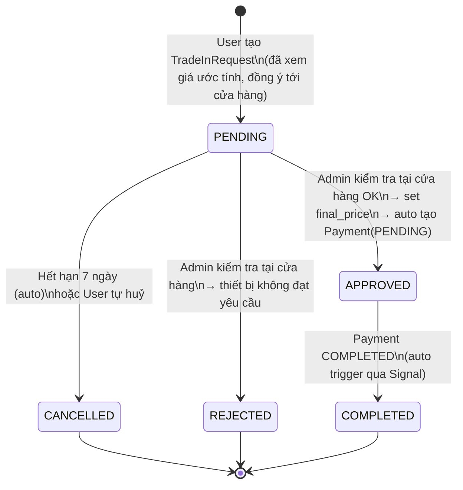
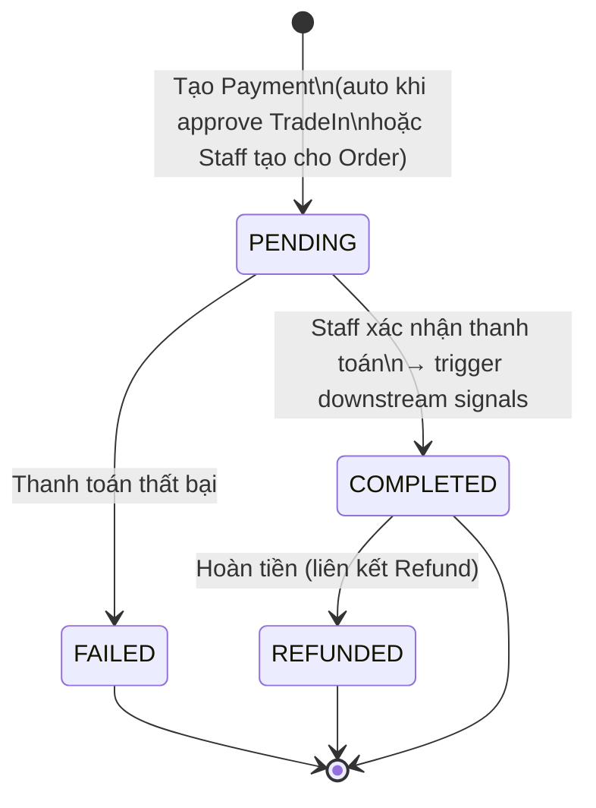

# Thiết kế Hệ thống Trade-in & Payment — Retech Market (v4)

## Tổng quan kiến trúc

Mô hình mua bán thiết bị cũ online + offline:
User nhập thông tin thiết bị + upload ảnh → Hệ thống **tự động định giá** (PricingService) → User xem giá ước tính trên UI → User đồng ý & tạo TradeInRequest → Mang tới cửa hàng trong **7 ngày** → Admin kiểm tra tận tay → **Thanh toán qua Payment app** → Hoàn tất.

### Hai luồng chính

| Luồng    | Tên            | Kết quả cuối                              |
| -------- | -------------- | ----------------------------------------- |
| SELL     | Bán lại        | User nhận tiền mặt tại cửa hàng           |
| EXCHANGE | Thu cũ đổi mới | Tạo ExchangeOrder + thanh toán chênh lệch |

### Thay đổi chính so với v3

- **Thêm** app `payment` — quản lý toàn bộ thanh toán (Trade-in + Order thường).
- **Bỏ** endpoint `POST /tradein/{id}/complete/` thủ công — giờ **Payment xác nhận tự động trigger completion**.
- **Sửa** Order `ALLOWED_TRANSITIONS` — thêm `PENDING → DELIVERED` cho Exchange order (giao dịch tại cửa hàng).
- **Cập nhật** `approve_tradein` — tự động tạo `Payment(PENDING)` sau khi approve.
- **Thêm** Signal: `Payment COMPLETED` → tự động hoàn tất TradeIn + Order.

---

## 1. State Machine — TradeInRequest



### Bảng ALLOWED_TRANSITIONS — TradeInRequest

| Từ        | Các trạng thái được phép chuyển sang |
| --------- | ------------------------------------ |
| PENDING   | APPROVED, REJECTED, CANCELLED        |
| APPROVED  | COMPLETED                            |
| REJECTED  | (terminal)                           |
| CANCELLED | (terminal)                           |
| COMPLETED | (terminal)                           |

---

## 2. Chỉnh sửa Order ALLOWED_TRANSITIONS

### Vấn đề

Luồng EXCHANGE tạo Order tại cửa hàng (PENDING), sau khi thanh toán cần chuyển thẳng sang DELIVERED. Nhưng Order hiện tại **không có transition PENDING → DELIVERED** (phải qua PROCESSING → SHIPPED → DELIVERED).

### Giải pháp

Thêm `PENDING → DELIVERED` vào `ALLOWED_TRANSITIONS` của Order.

```python
# orders/models.py — Order
ALLOWED_TRANSITIONS: dict[str, list[str]] = {
    Status.PENDING:    [Status.PROCESSING, Status.CANCELLED, Status.DELIVERED],
    #                                                        ^^^^^^^^^^^^^^^^
    #                                                        THÊM MỚI: cho Exchange order tại cửa hàng
    Status.PROCESSING: [Status.SHIPPED,    Status.CANCELLED],
    Status.SHIPPED:    [Status.DELIVERED],
    Status.DELIVERED:  [],
    Status.CANCELLED:  [],
    Status.RETURNED:   [],
}
```

> **Lưu ý**: Order thông thường (mua online) vẫn đi theo luồng PENDING → PROCESSING → SHIPPED → DELIVERED. Chỉ Exchange Order mới dùng shortcut PENDING → DELIVERED vì giao dịch diễn ra tại cửa hàng.

---

## 3. Models Layer — TradeIn

### 3.1 TradeInRequest

```python
class TradeInRequest(models.Model):

    class Status(models.TextChoices):
        PENDING   = "PENDING",   "Chờ tới cửa hàng"     # User đã tạo, hẹn tới trong 7 ngày
        APPROVED  = "APPROVED",  "Đã duyệt"              # Admin kiểm tra tại cửa hàng OK
        REJECTED  = "REJECTED",  "Từ chối"                # Admin từ chối
        CANCELLED = "CANCELLED", "Đã hủy"                 # Hết hạn 7 ngày / User tự huỷ
        COMPLETED = "COMPLETED", "Hoàn tất"               # Payment hoàn tất

    class TradeInType(models.TextChoices):
        SELL     = "SELL",     "Bán lại"
        EXCHANGE = "EXCHANGE", "Thu cũ đổi mới"

    ALLOWED_TRANSITIONS = {
        Status.PENDING:   [Status.APPROVED, Status.REJECTED, Status.CANCELLED],
        Status.APPROVED:  [Status.COMPLETED],
        Status.REJECTED:  [],
        Status.CANCELLED: [],
        Status.COMPLETED: [],
    }

    user         = models.ForeignKey(settings.AUTH_USER_MODEL, on_delete=models.PROTECT, related_name="tradeins", db_index=True)
    tradein_type = models.CharField(max_length=20, choices=TradeInType.choices, db_index=True)
    status       = models.CharField(max_length=20, choices=Status.choices, default=Status.PENDING, db_index=True)

    # Thông tin thiết bị cũ (User khai báo online)
    brand        = models.ForeignKey("products.Brand", on_delete=models.SET_NULL, null=True)
    category     = models.ForeignKey("products.Category", on_delete=models.SET_NULL, null=True)
    model_name   = models.CharField(max_length=255)
    storage      = models.CharField(max_length=50, blank=True)
    is_power_on  = models.BooleanField(default=True)
    screen_ok    = models.BooleanField(default=True)
    body_ok      = models.BooleanField(default=True)
    battery_percentage = models.PositiveSmallIntegerField(validators=[MinValueValidator(0), MaxValueValidator(100)])
    description  = models.TextField(blank=True)

    # Giá — 2 bước riêng biệt
    estimated_price = models.DecimalField(max_digits=12, decimal_places=0, null=True, blank=True)
    # ↑ PricingService tự tính khi User tạo TradeInRequest
    final_price     = models.DecimalField(max_digits=12, decimal_places=0, null=True, blank=True)
    # ↑ Admin set sau khi kiểm tra tận tay tại cửa hàng (bước APPROVED)

    # Luồng EXCHANGE: sản phẩm user muốn đổi sang
    target_product = models.ForeignKey("products.Product", on_delete=models.SET_NULL, null=True, blank=True, related_name="tradein_targets")

    # Timeout 7 ngày tới cửa hàng
    expires_at = models.DateTimeField()
    # ↑ auto set = created_at + 7 ngày khi tạo

    # Staff
    staff_note    = models.TextField(blank=True)
    reject_reason = models.TextField(blank=True, null=True)

    created_at = models.DateTimeField(auto_now_add=True, db_index=True)
    updated_at = models.DateTimeField(auto_now=True)

    class Meta:
        ordering = ["-created_at"]
        indexes  = [
            models.Index(fields=["user", "-created_at"]),
            models.Index(fields=["status", "tradein_type"]),
            models.Index(fields=["status", "-created_at"]),
            models.Index(fields=["status", "expires_at"]),  # cho query timeout
        ]

    def change_status(self, new_status: str) -> None:
        allowed = self.ALLOWED_TRANSITIONS.get(self.status, [])
        if new_status not in allowed:
            raise ValidationError(f"Không thể chuyển từ '{self.status}' sang '{new_status}'.")
        self.status = new_status
        self.save(update_fields=["status", "updated_at"])
```

### 3.2 TradeInPriceConfig (Giữ nguyên)

Dùng để hệ thống tự động tính `estimated_price`. Thêm `unique_together`:

```python
class Meta:
    unique_together = ("brand", "category", "model_name", "storage")
```

### 3.3 TradeInImage (Giữ nguyên)

Upload ảnh kèm theo TradeInRequest. Max 5 ảnh, mỗi ảnh ≤ 5 MB (validate ở Serializer).

```python
class TradeInImage(models.Model):
    tradein     = models.ForeignKey(TradeInRequest, on_delete=models.CASCADE, related_name="images")
    image       = models.ImageField(upload_to="tradeins/")
    uploaded_at = models.DateTimeField(auto_now_add=True)
```

### 3.4 TradeInTempImage (hỗ trợ staged upload)

Lưu ảnh tạm trước khi TradeInRequest tồn tại.

```python
class TradeInTempImage(models.Model):
    """Ảnh tạm trước khi tạo TradeInRequest."""
    session_key = models.UUIDField(db_index=True)
    image       = models.ImageField(upload_to="tradein_temp/")
    is_used     = models.BooleanField(default=False)
    created_at  = models.DateTimeField(auto_now_add=True)

    class Meta:
        indexes = [
            models.Index(fields=["session_key", "is_used"]),
        ]
```

### 3.5 ExchangeOrder (chỉ cho luồng EXCHANGE)

Được tạo sau khi Admin APPROVED tại cửa hàng.

```python
class ExchangeOrder(models.Model):
    tradein_request   = models.OneToOneField(TradeInRequest, on_delete=models.PROTECT, related_name="exchange_order")
    order             = models.OneToOneField("orders.Order", on_delete=models.PROTECT, related_name="exchange_order")
    # Chênh lệch = target_product.price - tradein.final_price
    # Dương: User trả thêm tiền. Âm: Cửa hàng trả tiền thừa cho User.
    difference_amount = models.DecimalField(max_digits=12, decimal_places=0)
    created_at        = models.DateTimeField(auto_now_add=True)
```

---

## 4. Chiến lược Upload Ảnh (Production)

### Vấn đề

User nhập thông tin + upload ảnh **trước** khi tạo TradeInRequest → chưa có `tradein_id` để liên kết ảnh.

### Giải pháp: **Staged Upload với `session_key`**

```
┌─────────────┐     ┌───────────────────────┐     ┌─────────────────────────┐
│ 1. User mở  │     │ 2. Upload từng ảnh    │     │ 3. Tạo TradeInRequest   │
│    form      │     │    POST /tradein/     │     │    POST /tradein/       │
│    → Client  │────→│    upload_temp/       │────→│    {session_key, ...}   │
│    tạo UUID  │     │    {session_key, file}│     │    → move ảnh tạm      │
│ (session_key)│     │    → lưu vào temp     │     │    → tạo TradeInImage   │
└─────────────┘     └───────────────────────┘     └─────────────────────────┘
```

#### Luồng chi tiết:

1. **Client tạo `session_key`** (UUID v4) khi mở form trade-in.

2. **Upload ảnh tạm** — `POST /tradein/upload_temp/`

   ```json
   // Request: multipart/form-data
   {
     "session_key": "550e8400-e29b-41d4-a716-446655440000",
     "image": "<file>"
   }
   // Response:
   {
     "id": 1,
     "session_key": "550e8400-...",
     "image_url": "/media/tradein_temp/1.jpg"
   }
   ```

   - Validate: max 5 ảnh/session, mỗi ảnh ≤ 5 MB, chỉ JPEG/PNG.

3. **Xoá ảnh tạm** — `DELETE /tradein/delete_temp/{id}/`
   - User có thể xoá ảnh đã upload trước khi tạo TradeInRequest.

4. **Định giá** — `POST /tradein/estimate/`
   - Gửi thông tin thiết bị (không cần ảnh cho PricingService hiện tại).
   - Future: có thể truyền `session_key` để AI phân tích ảnh.

5. **Tạo TradeInRequest** — `POST /tradein/`
   - Gửi thông tin thiết bị + `session_key`.
   - Backend: **move** ảnh từ `TradeInTempImage` → tạo `TradeInImage` + liên kết với TradeInRequest.
   - Đánh `is_used = True` trên các TradeInTempImage đã dùng.

6. **Cleanup orphaned temp** — Celery Beat task chạy mỗi ngày:
   - Xoá các `TradeInTempImage` có `is_used=False` và `created_at` > 24 giờ.
   - Xoá cả file ảnh trên disk.

---

## 5. Payment App — Thiết kế đầy đủ

### 5.1 Tổng quan

App `payment` quản lý **toàn bộ giao dịch thanh toán** trong hệ thống, bao gồm:

| Loại thanh toán       | Hướng tiền       | Mô tả                                         |
| --------------------- | ---------------- | --------------------------------------------- |
| `ORDER`               | INBOUND          | User trả tiền mua hàng (đơn hàng thường)      |
| `TRADEIN_SELL_PAYOUT` | OUTBOUND         | Cửa hàng trả tiền cho User (bán lại thiết bị) |
| `TRADEIN_EXCHANGE`    | INBOUND/OUTBOUND | Thanh toán chênh lệch khi đổi máy             |

### 5.2 Model — Payment

```python
class Payment(models.Model):

    class PaymentType(models.TextChoices):
        ORDER                = "ORDER",                "Thanh toán đơn hàng"
        TRADEIN_SELL_PAYOUT  = "TRADEIN_SELL_PAYOUT",  "Chi trả trade-in (bán lại)"
        TRADEIN_EXCHANGE     = "TRADEIN_EXCHANGE",     "Thanh toán trade-in (đổi máy)"

    class PaymentMethod(models.TextChoices):
        CASH            = "CASH",            "Tiền mặt"
        BANK_TRANSFER   = "BANK_TRANSFER",   "Chuyển khoản ngân hàng"

    class Direction(models.TextChoices):
        INBOUND  = "INBOUND",  "User trả tiền cho cửa hàng"
        OUTBOUND = "OUTBOUND", "Cửa hàng trả tiền cho User"

    class Status(models.TextChoices):
        PENDING   = "PENDING",   "Chờ thanh toán"
        COMPLETED = "COMPLETED", "Hoàn tất"
        FAILED    = "FAILED",    "Thất bại"
        REFUNDED  = "REFUNDED",  "Đã hoàn tiền"

    ALLOWED_TRANSITIONS = {
        Status.PENDING:   [Status.COMPLETED, Status.FAILED],
        Status.COMPLETED: [Status.REFUNDED],
        Status.FAILED:    [],
        Status.REFUNDED:  [],
    }

    user            = models.ForeignKey(settings.AUTH_USER_MODEL, on_delete=models.PROTECT, related_name="payments", db_index=True)
    payment_type    = models.CharField(max_length=30, choices=PaymentType.choices, db_index=True)
    payment_method  = models.CharField(max_length=20, choices=PaymentMethod.choices)
    direction       = models.CharField(max_length=10, choices=Direction.choices)
    status          = models.CharField(max_length=20, choices=Status.choices, default=Status.PENDING, db_index=True)
    amount          = models.DecimalField(max_digits=12, decimal_places=0)
    # ↑ Luôn dương. Hướng tiền xác định bởi field `direction`.

    # Liên kết — nullable, tuỳ loại thanh toán
    order            = models.ForeignKey("orders.Order", on_delete=models.PROTECT, null=True, blank=True, related_name="payments")
    tradein_request  = models.ForeignKey("tradein.TradeInRequest", on_delete=models.PROTECT, null=True, blank=True, related_name="payments")

    # Metadata
    note             = models.TextField(blank=True)
    transaction_ref  = models.CharField(max_length=255, blank=True)
    # ↑ Mã giao dịch ngân hàng (nếu chuyển khoản)

    # Xác nhận bởi Staff
    confirmed_by = models.ForeignKey(settings.AUTH_USER_MODEL, on_delete=models.SET_NULL, null=True, blank=True, related_name="confirmed_payments")
    confirmed_at = models.DateTimeField(null=True, blank=True)

    created_at = models.DateTimeField(auto_now_add=True, db_index=True)
    updated_at = models.DateTimeField(auto_now=True)

    class Meta:
        ordering = ["-created_at"]
        indexes = [
            models.Index(fields=["user", "-created_at"]),
            models.Index(fields=["status", "payment_type"]),
            models.Index(fields=["tradein_request", "status"]),
            models.Index(fields=["order", "status"]),
        ]

    def change_status(self, new_status: str) -> None:
        allowed = self.ALLOWED_TRANSITIONS.get(self.status, [])
        if new_status not in allowed:
            raise ValidationError(f"Không thể chuyển từ '{self.status}' sang '{new_status}'.")
        self.status = new_status
        self.save(update_fields=["status", "updated_at"])

    def __str__(self):
        return f"Payment #{self.id} — {self.payment_type} — {self.amount}đ — {self.status}"
```

### 5.3 State Machine — Payment



### 5.4 Service — PaymentService

```python
class PaymentService:

    @staticmethod
    @transaction.atomic
    def create_tradein_payment(tradein: TradeInRequest) -> Payment:
        """
        Tự động tạo Payment khi TradeIn được APPROVED.
        Được gọi bởi TradeInService.approve_tradein() — KHÔNG gọi trực tiếp từ View.

        Logic xác định direction + amount:
          - SELL:
              direction = OUTBOUND (cửa hàng trả tiền cho User)
              amount    = tradein.final_price
              payment_type = TRADEIN_SELL_PAYOUT

          - EXCHANGE:
              difference = target_product.price - tradein.final_price
              Nếu difference > 0:
                  direction = INBOUND (User trả thêm)
                  amount    = difference
              Nếu difference < 0:
                  direction = OUTBOUND (cửa hàng trả lại User)
                  amount    = abs(difference)
              Nếu difference == 0:
                  direction = INBOUND
                  amount    = 0
              payment_type = TRADEIN_EXCHANGE

        Liên kết:
          - tradein_request = tradein
          - order = tradein.exchange_order.order (EXCHANGE only)
          - user = tradein.user
        """

    @staticmethod
    @transaction.atomic
    def create_order_payment(order: Order, payment_method: str, amount: Decimal) -> Payment:
        """
        Staff tạo Payment cho đơn hàng thường.
        direction = INBOUND, payment_type = ORDER.
        Liên kết: order = order, user = order.user.
        """

    @staticmethod
    @transaction.atomic
    def confirm_payment(payment: Payment, staff_user, payment_method: str, transaction_ref: str = "", note: str = "") -> Payment:
        """
        Staff xác nhận thanh toán đã hoàn tất.
          1. select_for_update() trên Payment.
          2. Set payment_method, transaction_ref, note (nếu có).
          3. Set confirmed_by = staff_user, confirmed_at = now().
          4. Change status: PENDING → COMPLETED.
          5. Trigger downstream signals (xem Section 5.6).
        """

    @staticmethod
    @transaction.atomic
    def fail_payment(payment: Payment, staff_user, note: str = "") -> Payment:
        """
        Đánh dấu thanh toán thất bại: PENDING → FAILED.
        Không trigger downstream — TradeIn vẫn ở APPROVED, Staff có thể retry.
        """

    @staticmethod
    @transaction.atomic
    def refund_payment(payment: Payment, staff_user, note: str = "") -> Payment:
        """
        Hoàn tiền: COMPLETED → REFUNDED.
        Chỉ áp dụng cho Payment loại ORDER (liên kết với Refund app).
        Trade-in không hỗ trợ refund Payment (đã trao tay tại cửa hàng).
        """
```

### 5.5 Serializer Layer — Payment

| Serializer               | Dùng khi                         | Ai dùng |
| ------------------------ | -------------------------------- | ------- |
| PaymentDetailSerializer  | GET /payments/ + /payments/{id}/ | All     |
| PaymentCreateSerializer  | POST /payments/                  | Staff   |
| PaymentConfirmSerializer | POST /payments/{id}/confirm/     | Staff   |
| PaymentFailSerializer    | POST /payments/{id}/fail/        | Staff   |
| PaymentRefundSerializer  | POST /payments/{id}/refund/      | Staff   |

#### PaymentDetailSerializer

```python
class PaymentDetailSerializer(serializers.ModelSerializer):
    user_email          = serializers.ReadOnlyField(source="user.email")
    confirmed_by_email  = serializers.ReadOnlyField(source="confirmed_by.email")
    payment_type_display = serializers.SerializerMethodField()
    direction_display    = serializers.SerializerMethodField()
    status_display       = serializers.SerializerMethodField()

    class Meta:
        model = Payment
        fields = [
            "id", "user", "user_email",
            "payment_type", "payment_type_display",
            "payment_method", "direction", "direction_display",
            "status", "status_display", "amount",
            "order", "tradein_request",
            "note", "transaction_ref",
            "confirmed_by", "confirmed_by_email", "confirmed_at",
            "created_at", "updated_at",
        ]
```

#### PaymentCreateSerializer — Staff tạo Payment cho Order thường

```python
class PaymentCreateSerializer(serializers.Serializer):
    order_id       = serializers.IntegerField(min_value=1)
    payment_method = serializers.ChoiceField(choices=Payment.PaymentMethod.choices)
    amount         = serializers.DecimalField(max_digits=12, decimal_places=0, min_value=1)

    def validate_order_id(self, value):
        try:
            order = Order.objects.get(id=value, status=Order.Status.PENDING)
        except Order.DoesNotExist:
            raise ValidationError("Order không tồn tại hoặc không ở trạng thái PENDING.")
        # Kiểm tra chưa có Payment PENDING/COMPLETED cho order này
        if Payment.objects.filter(order=order, status__in=["PENDING", "COMPLETED"]).exists():
            raise ValidationError("Order này đã có Payment.")
        return value
```

#### PaymentConfirmSerializer — Staff xác nhận thanh toán

```python
class PaymentConfirmSerializer(serializers.Serializer):
    payment_method  = serializers.ChoiceField(choices=Payment.PaymentMethod.choices)
    transaction_ref = serializers.CharField(max_length=255, required=False, allow_blank=True)
    note            = serializers.CharField(required=False, allow_blank=True)
```

#### PaymentFailSerializer

```python
class PaymentFailSerializer(serializers.Serializer):
    note = serializers.CharField(required=False, allow_blank=True)
```

#### PaymentRefundSerializer

```python
class PaymentRefundSerializer(serializers.Serializer):
    note = serializers.CharField(required=False, allow_blank=True)
```

### 5.6 Signal — Payment COMPLETED triggers

Khi `PaymentService.confirm_payment()` chuyển Payment sang COMPLETED, các hành động downstream được trigger **trong cùng transaction**:

```python
# payment/signals.py

def on_payment_completed(payment: Payment) -> None:
    """
    Được gọi bởi PaymentService.confirm_payment() sau khi status = COMPLETED.
    Xử lý tuỳ payment_type:
    """

    if payment.payment_type == Payment.PaymentType.TRADEIN_SELL_PAYOUT:
        # SELL: Payment hoàn tất → TradeIn → COMPLETED
        tradein = payment.tradein_request
        tradein.change_status(TradeInRequest.Status.COMPLETED)

    elif payment.payment_type == Payment.PaymentType.TRADEIN_EXCHANGE:
        # EXCHANGE: Payment hoàn tất → Order PENDING → DELIVERED → TradeIn → COMPLETED
        tradein = payment.tradein_request
        exchange_order = tradein.exchange_order
        order = exchange_order.order

        order.change_status(Order.Status.DELIVERED)    # PENDING → DELIVERED
        tradein.change_status(TradeInRequest.Status.COMPLETED)

    elif payment.payment_type == Payment.PaymentType.ORDER:
        # Order thường: Payment hoàn tất → ghi log (Staff quản lý Order status riêng)
        pass
```

> **Lưu ý:** Các signal này chạy **đồng bộ trong cùng transaction** với `confirm_payment()`. Nếu bất kỳ bước nào fail → toàn bộ rollback.

### 5.7 View Layer — PaymentViewSet

| Action      | Method | URL                     | Quyền |
| ----------- | ------ | ----------------------- | ----- |
| list        | GET    | /payments/              | Staff |
| retrieve    | GET    | /payments/{id}/         | Staff |
| create      | POST   | /payments/              | Staff |
| confirm     | POST   | /payments/{id}/confirm/ | Staff |
| fail        | POST   | /payments/{id}/fail/    | Staff |
| refund      | POST   | /payments/{id}/refund/  | Staff |
| my_payments | GET    | /payments/my/           | User  |

```python
class PaymentViewSet(viewsets.ModelViewSet):
    permission_classes = [permissions.IsAdminUser]
    http_method_names  = ["get", "post", "head", "options"]

    def get_serializer_class(self):
        mapping = {
            "create":  PaymentCreateSerializer,
            "confirm": PaymentConfirmSerializer,
            "fail":    PaymentFailSerializer,
            "refund":  PaymentRefundSerializer,
        }
        return mapping.get(self.action, PaymentDetailSerializer)

    def get_permissions(self):
        if self.action == "my_payments":
            return [permissions.IsAuthenticated()]
        return [permissions.IsAdminUser()]

    def get_queryset(self):
        return (
            Payment.objects.select_related("user", "confirmed_by", "order", "tradein_request")
            .all()
        )

    # POST /payments/ — Staff tạo Payment cho Order thường
    def create(self, request, *args, **kwargs):
        serializer = self.get_serializer(data=request.data)
        serializer.is_valid(raise_exception=True)
        payment = PaymentService.create_order_payment(
            order=Order.objects.get(id=serializer.validated_data["order_id"]),
            payment_method=serializer.validated_data["payment_method"],
            amount=serializer.validated_data["amount"],
        )
        return Response(PaymentDetailSerializer(payment).data, status=201)

    # POST /payments/{id}/confirm/
    @action(detail=True, methods=["post"], url_path="confirm")
    def confirm(self, request, pk=None):
        payment = self.get_object()
        serializer = self.get_serializer(data=request.data)
        serializer.is_valid(raise_exception=True)
        payment = PaymentService.confirm_payment(
            payment=payment,
            staff_user=request.user,
            payment_method=serializer.validated_data["payment_method"],
            transaction_ref=serializer.validated_data.get("transaction_ref", ""),
            note=serializer.validated_data.get("note", ""),
        )
        return Response(PaymentDetailSerializer(payment).data)

    # POST /payments/{id}/fail/
    @action(detail=True, methods=["post"], url_path="fail")
    def fail(self, request, pk=None):
        payment = self.get_object()
        serializer = self.get_serializer(data=request.data)
        serializer.is_valid(raise_exception=True)
        payment = PaymentService.fail_payment(
            payment=payment,
            staff_user=request.user,
            note=serializer.validated_data.get("note", ""),
        )
        return Response(PaymentDetailSerializer(payment).data)

    # POST /payments/{id}/refund/
    @action(detail=True, methods=["post"], url_path="refund")
    def refund(self, request, pk=None):
        payment = self.get_object()
        serializer = self.get_serializer(data=request.data)
        serializer.is_valid(raise_exception=True)
        payment = PaymentService.refund_payment(
            payment=payment,
            staff_user=request.user,
            note=serializer.validated_data.get("note", ""),
        )
        return Response(PaymentDetailSerializer(payment).data)

    # GET /payments/my/ — User xem Payment của mình
    @action(detail=False, methods=["get"], url_path="my")
    def my_payments(self, request):
        queryset = self.get_queryset().filter(user=request.user)
        serializer = PaymentDetailSerializer(queryset, many=True)
        return Response(serializer.data)
```

### 5.8 URL Config — Payment

```python
# payment/urls.py
from rest_framework.routers import DefaultRouter
from .views import PaymentViewSet

router = DefaultRouter()
router.register("", PaymentViewSet, basename="payment")

urlpatterns = router.urls

# config/urls.py — thêm:
path("api/payments/", include("payment.urls")),
```

---

## 6. Service Layer — TradeIn (cập nhật với Payment)

### 6.1 PricingService (giữ nguyên)

```python
class PricingService:

    @staticmethod
    def estimate_price(data: dict) -> dict:
        """
        Tính giá ước tính dựa trên TradeInPriceConfig.
        Stateless — KHÔNG lưu DB, chỉ trả về kết quả.

        Input: {
            brand_id, category_id, model_name, storage,
            is_power_on, screen_ok, body_ok, battery_percentage,
            tradein_type, target_product_id (optional)
        }

        Output: {
            "estimated_price": Decimal,          # Giá ước tính cho thiết bị cũ
            "target_product_price": Decimal|None, # EXCHANGE only: giá sản phẩm mới
            "difference_amount": Decimal|None     # EXCHANGE only: chênh lệch phải trả
        }

        Trả về estimated_price = None nếu không tìm thấy config phù hợp.
        Logic tính: base_price - deduction (is_power_on, screen_ok, body_ok, battery).
        """
```

### 6.2 TradeInService (CẬP NHẬT)

```python
class TradeInService:

    EXPIRY_DAYS = 7  # Hạn tới cửa hàng

    @staticmethod
    @transaction.atomic
    def create_tradein(user, validated_data: dict, session_key: str) -> TradeInRequest:
        """
        Tạo TradeInRequest mới (User đã xem giá ước tính, đồng ý tới cửa hàng):
          1. Tính estimated_price (PricingService).
          2. Set expires_at = now() + 7 ngày.
          3. (EXCHANGE) select_for_update() trên target_product:
             - Check is_sold == False.
             - Đánh is_sold = True (giữ chỗ sản phẩm cho User).
          4. Move ảnh từ TradeInTempImage → TradeInImage.
          5. Status = PENDING.
        """

    @staticmethod
    @transaction.atomic
    def approve_tradein(tradein, final_price: Decimal, staff_note: str) -> TradeInRequest:
        """
        Admin kiểm tra thiết bị tại cửa hàng → set final_price → PENDING → APPROVED.
          1. select_for_update() trên TradeInRequest.
          2. Set final_price, staff_note.
          3. Change status: PENDING → APPROVED.
          4. (EXCHANGE) Gọi ExchangeOrderService.create_exchange_order().
          5. ★ Gọi PaymentService.create_tradein_payment(tradein) → tạo Payment(PENDING).
        Return: TradeInRequest (APPROVED) + Payment(PENDING) đã sẵn sàng cho Staff confirm.
        """

    @staticmethod
    @transaction.atomic
    def reject_tradein(tradein, reject_reason: str) -> TradeInRequest:
        """
        Admin từ chối (từ PENDING).
        Bắt buộc cung cấp lý do từ chối.
        (EXCHANGE) Revert target_product.is_sold = False — select_for_update().
        """

    @staticmethod
    @transaction.atomic
    def cancel_tradein(tradein, staff_note: str = "") -> TradeInRequest:
        """
        Huỷ TradeInRequest: PENDING → CANCELLED.
        Được gọi bởi:
          - User tự huỷ (staff_note rỗng).
          - Celery timeout task (staff_note = "Hết hạn: User không tới cửa hàng trong 7 ngày").
        (EXCHANGE) Revert target_product.is_sold = False — select_for_update().
        """

    @staticmethod
    def auto_cancel_expired() -> int:
        """
        Celery Beat task — chạy mỗi giờ.
        Tìm tất cả TradeInRequest có status=PENDING và expires_at < now().
        Gọi cancel_tradein() cho từng request.
        Return: số lượng đã cancel.
        """
```

> **Thay đổi so với v3:** Bỏ `complete_tradein()` — việc hoàn tất giờ do **Payment Signal** tự động trigger (xem Section 5.6). Không còn endpoint `/tradein/{id}/complete/`.

### 6.3 ExchangeOrderService (giữ nguyên)

```python
class ExchangeOrderService:

    @staticmethod
    @transaction.atomic
    def create_exchange_order(tradein: TradeInRequest) -> ExchangeOrder:
        """
        Được gọi bởi TradeInService.approve_tradein() — không gọi trực tiếp từ View.
        Tạo Order (status=PENDING) + OrderItem + ExchangeOrder.
        difference_amount = target_product.price - tradein.final_price.
        Lưu ý: target_product.is_sold đã = True từ lúc tạo TradeInRequest,
                không cần check lại ở đây.
        """
```

---

## 7. Serializer Layer — TradeIn (cập nhật)

| Serializer                | Dùng khi                       | Ai dùng |
| ------------------------- | ------------------------------ | ------- |
| TradeInEstimateSerializer | POST /tradein/estimate/        | User    |
| TradeInCreateSerializer   | POST /tradein/                 | User    |
| TradeInDetailSerializer   | GET /tradein/ + /tradein/{id}/ | All     |
| StaffApproveSerializer    | POST /tradein/{id}/approve/    | Staff   |
| StaffRejectSerializer     | POST /tradein/{id}/reject/     | Staff   |
| TempImageUploadSerializer | POST /tradein/upload_temp/     | User    |

#### TradeInEstimateSerializer — Input cho API estimate (không tạo model)

```python
class TradeInEstimateSerializer(serializers.Serializer):
    tradein_type       = ChoiceField(choices=TradeInRequest.TradeInType.choices)
    brand_id           = IntegerField()
    category_id        = IntegerField()
    model_name         = CharField(max_length=255)
    storage            = CharField(max_length=50, required=False, allow_blank=True)
    is_power_on        = BooleanField(default=True)
    screen_ok          = BooleanField(default=True)
    body_ok            = BooleanField(default=True)
    battery_percentage = IntegerField(min_value=0, max_value=100)
    target_product_id  = IntegerField(required=False)  # EXCHANGE only

    def validate(self, attrs):
        if attrs["tradein_type"] == "EXCHANGE" and not attrs.get("target_product_id"):
            raise ValidationError({"target_product_id": "Bắt buộc khi chọn 'Thu cũ đổi mới'."})
        return attrs
```

#### TradeInCreateSerializer — Tạo TradeInRequest

```python
class TradeInCreateSerializer(serializers.ModelSerializer):
    session_key = UUIDField()  # Liên kết với ảnh đã upload tạm

    class Meta:
        model = TradeInRequest
        fields = [
            "tradein_type", "brand", "category", "model_name", "storage",
            "is_power_on", "screen_ok", "body_ok", "battery_percentage",
            "description", "target_product", "session_key",
        ]

    def validate(self, attrs):
        if attrs["tradein_type"] == "EXCHANGE" and not attrs.get("target_product"):
            raise ValidationError({"target_product": "Bắt buộc khi chọn 'Thu cũ đổi mới'."})
        # Check có ảnh tạm không
        session_key = attrs.get("session_key")
        if not TradeInTempImage.objects.filter(session_key=session_key, is_used=False).exists():
            raise ValidationError({"session_key": "Chưa upload ảnh nào."})
        return attrs
```

#### TradeInDetailSerializer — Đọc TradeInRequest (thêm payment info)

```python
class TradeInDetailSerializer(serializers.ModelSerializer):
    images      = TradeInImageSerializer(many=True, read_only=True)
    payment     = serializers.SerializerMethodField()

    class Meta:
        model = TradeInRequest
        fields = [
            "id", "user", "tradein_type", "status",
            "brand", "category", "model_name", "storage",
            "is_power_on", "screen_ok", "body_ok", "battery_percentage",
            "description", "estimated_price", "final_price",
            "target_product", "expires_at",
            "staff_note", "reject_reason",
            "images", "payment",
            "created_at", "updated_at",
        ]

    def get_payment(self, obj):
        """Trả về Payment mới nhất liên kết với TradeIn (nếu có)."""
        payment = obj.payments.order_by("-created_at").first()
        if payment:
            return {
                "id": payment.id,
                "status": payment.status,
                "amount": payment.amount,
                "direction": payment.direction,
                "payment_method": payment.payment_method,
            }
        return None
```

#### StaffApproveSerializer — Admin set giá cuối tại cửa hàng

```python
final_price = DecimalField(min_value=1)
staff_note  = CharField(allow_blank=True)
```

#### StaffRejectSerializer — Admin từ chối

```python
reject_reason = CharField(min_length=1)
```

#### TempImageUploadSerializer — Upload ảnh tạm

```python
class TempImageUploadSerializer(serializers.Serializer):
    session_key = UUIDField()
    image       = ImageField()

    def validate_image(self, value):
        if value.size > 5 * 1024 * 1024:
            raise ValidationError("Ảnh không được vượt quá 5 MB.")
        return value

    def validate(self, attrs):
        count = TradeInTempImage.objects.filter(
            session_key=attrs["session_key"], is_used=False
        ).count()
        if count >= 5:
            raise ValidationError("Tối đa 5 ảnh.")
        return attrs
```

---

## 8. View Layer — TradeIn Endpoint API (cập nhật)

### TradeInViewSet

| Action      | Method | URL                        | Quyền                |
| ----------- | ------ | -------------------------- | -------------------- |
| estimate    | POST   | /tradein/estimate/         | IsAuthenticated      |
| upload_temp | POST   | /tradein/upload_temp/      | IsAuthenticated      |
| delete_temp | DELETE | /tradein/delete_temp/{id}/ | Owner của ảnh tạm    |
| create      | POST   | /tradein/                  | IsAuthenticated      |
| list        | GET    | /tradein/                  | IsAuthenticated      |
| retrieve    | GET    | /tradein/{id}/             | Owner hoặc Staff     |
| cancel      | POST   | /tradein/{id}/cancel/      | Owner + PENDING only |
| approve     | POST   | /tradein/{id}/approve/     | Staff only           |
| reject      | POST   | /tradein/{id}/reject/      | Staff only           |

> **Thay đổi so với v3:** Bỏ `complete` action. Completion giờ tự động qua Payment Signal.

```python
def get_permissions(self):
    staff_actions = ["approve", "reject"]
    if self.action in staff_actions:
        return [permissions.IsAdminUser()]
    return [permissions.IsAuthenticated()]

def get_serializer_class(self):
    mapping = {
        "estimate":    TradeInEstimateSerializer,
        "create":      TradeInCreateSerializer,
        "approve":     StaffApproveSerializer,
        "reject":      StaffRejectSerializer,
        "upload_temp": TempImageUploadSerializer,
    }
    return mapping.get(self.action, TradeInDetailSerializer)
```

---

## 9. Race Condition Prevention

| Tình huống                              | Khi nào xảy ra    | Giải pháp                                           |
| --------------------------------------- | ----------------- | --------------------------------------------------- |
| 2 User cùng tạo EXCHANGE cho 1 sản phẩm | `create_tradein`  | `select_for_update()` trên Product, check `is_sold` |
| User tạo EXCHANGE + sản phẩm vừa bán    | `create_tradein`  | `select_for_update()` trên Product, check `is_sold` |
| 2 Staff cùng approve 1 TradeIn          | `approve_tradein` | `select_for_update()` trên TradeInRequest           |
| 2 Staff cùng confirm 1 Payment          | `confirm_payment` | `select_for_update()` trên Payment                  |

> **Lưu ý:** Vì `is_sold = True` được set ngay khi tạo TradeInRequest (EXCHANGE), không cần check race condition ở bước approve cho Product nữa. Khi REJECTED/CANCELLED → revert `is_sold = False` (có `select_for_update()`).

---

## 10. Timeout & Celery Tasks

### 10.1 Auto-cancel expired TradeInRequests

```python
# tradein/tasks.py
from celery import shared_task

@shared_task
def auto_cancel_expired_tradeins():
    """Chạy mỗi giờ bởi Celery Beat."""
    count = TradeInService.auto_cancel_expired()
    return f"Cancelled {count} expired trade-in requests."
```

### 10.2 Cleanup orphaned temp images

```python
@shared_task
def cleanup_orphaned_temp_images():
    """Xoá ảnh tạm > 24h chưa được dùng."""
    cutoff = now() - timedelta(hours=24)
    orphaned = TradeInTempImage.objects.filter(created_at__lt=cutoff, is_used=False)
    for img in orphaned:
        img.image.delete(save=False)  # Xoá file trên disk
    count = orphaned.count()
    orphaned.delete()
    return f"Cleaned up {count} orphaned temp images."
```

### 10.3 Celery Beat Schedule

```python
# settings.py
CELERY_BEAT_SCHEDULE = {
    "auto-cancel-expired-tradeins": {
        "task": "tradein.tasks.auto_cancel_expired_tradeins",
        "schedule": crontab(minute=0),  # Mỗi giờ
    },
    "cleanup-orphaned-temp-images": {
        "task": "tradein.tasks.cleanup_orphaned_temp_images",
        "schedule": crontab(hour=3, minute=0),  # 3h sáng mỗi ngày
    },
}
```

---

## 11. Luồng đầy đủ (với Payment)

### Luồng SELL (Bán lại)

```
[User]  Mở form Trade-in → Client tạo session_key (UUID)
[User]  POST /tradein/upload_temp/        → Upload ảnh thiết bị (tạm)
[User]  POST /tradein/estimate/           → Xem giá ước tính trên UI
        {tradein_type: "SELL", brand_id, model_name, ...}
        → Response: {estimated_price: 5000000}
[User]  POST /tradein/                    → PENDING
        (tạo TradeInRequest + move ảnh tạm + set expires_at = now + 7 ngày)
                                            ⏱️ 7 ngày countdown
        --- User mang thiết bị tới cửa hàng ---
[Staff] POST /tradein/{id}/approve/       → APPROVED  (Admin kiểm tra OK, set final_price)
            └→ ★ Payment(PENDING) được tạo tự động
            └→ type=TRADEIN_SELL_PAYOUT, direction=OUTBOUND, amount=final_price
        hoặc
[Staff] POST /tradein/{id}/reject/        → REJECTED  (Thiết bị không đạt)
        hoặc
[User]  POST /tradein/{id}/cancel/        → CANCELLED (User tự huỷ)
        hoặc
        ⏱️ Hết 7 ngày                    → CANCELLED (Celery auto-cancel)

        --- Thanh toán ---
[Staff] POST /payments/{id}/confirm/      → Payment: PENDING → COMPLETED
            └→ ★ Signal: TradeInRequest APPROVED → COMPLETED  (tự động)
```

### Luồng EXCHANGE (Thu cũ đổi mới)

```
[User]  Vào Product Detail → click "Trade-in"
[User]  Mở form Trade-in → Client tạo session_key (UUID)
[User]  POST /tradein/upload_temp/        → Upload ảnh thiết bị (tạm)
[User]  POST /tradein/estimate/           → Xem giá ước tính + chênh lệch trên UI
        {tradein_type: "EXCHANGE", target_product_id: 123, brand_id, ...}
        → Response: {estimated_price: 5000000, target_product_price: 15000000, difference_amount: 10000000}
[User]  POST /tradein/                    → PENDING
        (tạo TradeInRequest + đánh target_product.is_sold = True + move ảnh tạm)
                                            ⏱️ 7 ngày countdown
        --- User mang thiết bị tới cửa hàng ---
[Staff] POST /tradein/{id}/approve/       → APPROVED
            └→ set final_price
            └→ ExchangeOrder + Order (PENDING) được tạo tự động
            └→ difference_amount = target_product.price - final_price
            └→ ★ Payment(PENDING) được tạo tự động
            └→ type=TRADEIN_EXCHANGE, amount=|difference_amount|
            └→ direction=INBOUND nếu User trả thêm, OUTBOUND nếu cửa hàng trả lại
        hoặc
[Staff] POST /tradein/{id}/reject/        → REJECTED
            └→ Revert target_product.is_sold = False
        hoặc
[User]  POST /tradein/{id}/cancel/        → CANCELLED
            └→ Revert target_product.is_sold = False
        hoặc
        ⏱️ Hết 7 ngày                    → CANCELLED
            └→ Revert target_product.is_sold = False

        --- Thanh toán ---
[Staff] POST /payments/{id}/confirm/      → Payment: PENDING → COMPLETED
            └→ ★ Signal: Order PENDING → DELIVERED                (tự động)
            └→ ★ Signal: TradeInRequest APPROVED → COMPLETED      (tự động)
```

### Luồng Normal Order (mua hàng thường)

```
[User]  POST /orders/                     → Order PENDING
[Staff] POST /payments/                   → Tạo Payment(PENDING) cho Order
        {order_id, payment_method, amount}
[Staff] POST /payments/{id}/confirm/      → Payment: PENDING → COMPLETED
        (Staff quản lý Order status riêng: PROCESSING → SHIPPED → DELIVERED)
[Staff] PATCH /orders/{id}/               → Cập nhật Order status thủ công
```

> **Lưu ý:** Với Order thường, Payment COMPLETED **không** tự động đổi Order status. Staff vẫn quản lý luồng PROCESSING → SHIPPED → DELIVERED thủ công vì có shipping.

---

## 12. Tổng quan Sequence Diagram

### SELL

```
User            Frontend         Backend (TradeIn)    Backend (Payment)    DB
 │                │                    │                    │               │
 │── Mở form ───→│                    │                    │               │
 │                │── upload_temp ───→│                    │               │
 │                │── estimate ──────→│                    │               │
 │                │←── giá ước tính ──│                    │               │
 │── Đồng ý ────→│── POST /tradein/ →│                    │               │
 │                │                    │──── save ────────→│               │──→ TradeIn(PENDING)
 │                                     │                    │               │
 │    ⏱️ User mang tới cửa hàng       │                    │               │
 │                                     │                    │               │
Staff                                  │                    │               │
 │── approve ────────────────────────→│                    │               │
 │                                     │── create_payment →│               │
 │                                     │                    │──── save ───→│──→ Payment(PENDING)
 │                                     │←── APPROVED ──────│               │──→ TradeIn(APPROVED)
 │                                     │                    │               │
 │── confirm payment ─────────────────────────────────────→│               │
 │                                     │                    │──── save ───→│──→ Payment(COMPLETED)
 │                                     │←── signal ────────│               │──→ TradeIn(COMPLETED)
```

### EXCHANGE

```
User            Frontend         Backend (TradeIn)    Backend (Payment)    DB
 │                │                    │                    │               │
 │── Product Detail → click Trade-in  │                    │               │
 │                │── upload_temp ───→│                    │               │
 │                │── estimate ──────→│                    │               │
 │                │←── giá + chênh lệch                   │               │
 │── Đồng ý ────→│── POST /tradein/ →│                    │               │
 │                │                    │──── save ────────→│               │──→ TradeIn(PENDING)
 │                │                    │                    │               │──→ Product.is_sold=True
 │                                     │                    │               │
 │    ⏱️ User mang tới cửa hàng       │                    │               │
 │                                     │                    │               │
Staff                                  │                    │               │
 │── approve ────────────────────────→│                    │               │
 │                                     │──── save ────────→│               │──→ TradeIn(APPROVED)
 │                                     │──── save ────────→│               │──→ ExchangeOrder + Order(PENDING)
 │                                     │── create_payment →│               │
 │                                     │                    │──── save ───→│──→ Payment(PENDING)
 │                                     │                    │               │
 │── confirm payment ─────────────────────────────────────→│               │
 │                                     │                    │──── save ───→│──→ Payment(COMPLETED)
 │                                     │←── signal ────────│               │──→ Order(DELIVERED)
 │                                     │←── signal ────────│               │──→ TradeIn(COMPLETED)
```

---

## 13. Migrations cần tạo

| App     | Model              | Thay đổi                                            |
| ------- | ------------------ | --------------------------------------------------- |
| tradein | TradeInRequest     | Bỏ status PRICED, ACCEPTED; thêm field `expires_at` |
| tradein | TradeInTempImage   | Tạo mới (session_key, image, is_used, created_at)   |
| tradein | ExchangeOrder      | Giữ nguyên                                          |
| tradein | TradeInPriceConfig | Giữ nguyên                                          |
| orders  | Order              | Thêm DELIVERED vào ALLOWED_TRANSITIONS[PENDING]     |
| payment | Payment            | Tạo mới (toàn bộ fields + indexes)                  |

---

## 14. Cấu trúc thư mục Payment App

```
payment/
    __init__.py
    admin.py
    apps.py
    models.py          # Payment model
    serializers.py     # All serializers
    services.py        # PaymentService
    signals.py         # on_payment_completed logic
    urls.py            # Router config
    views.py           # PaymentViewSet
    tests.py
    migrations/
        __init__.py
```
